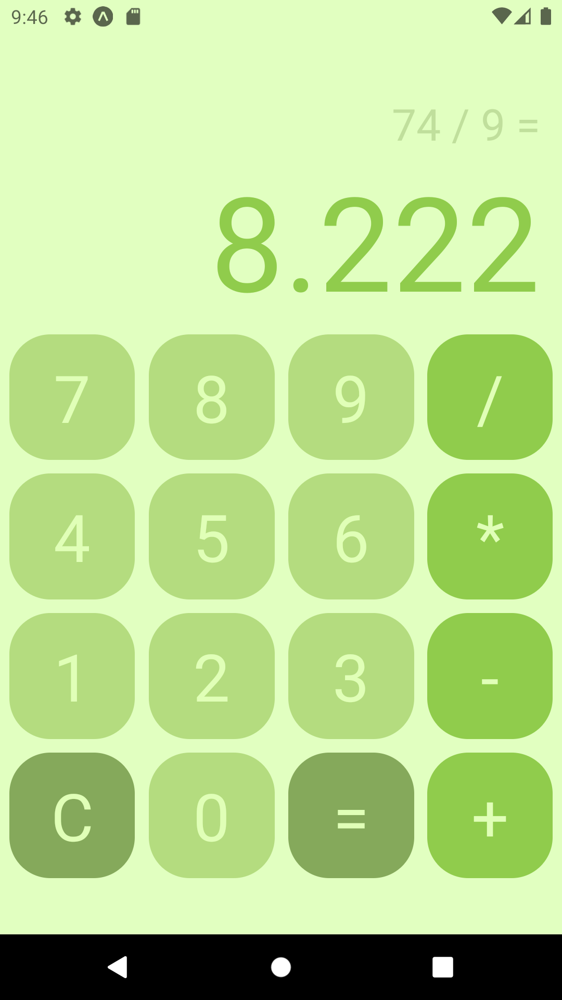

# Calculator App

This is a simple calculator app that I made to explain the basics about React Native. The calculator can do the four math basic operation: addition,
subtraction, multiplication and division. The code can be improved to adjust display for large numbers or erase mistyped numbers.

## Preview

&nbsp;&nbsp;&nbsp;&nbsp;

## How to run this app

Clone this repository:

        https://github.com/matt-ritton/app.calculator.git

Run 'npm install' command to install all necessaries dependencies:

        npm install

Run the command below to start Expo server in your machine:

        expo start